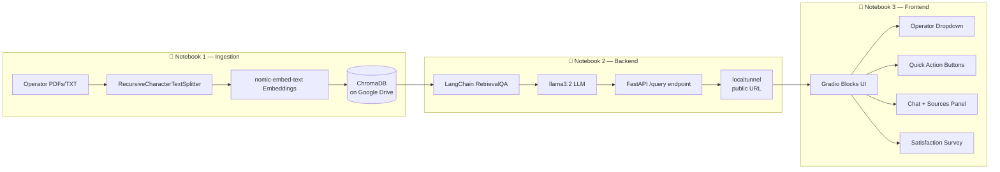

# 📞 Egyptian Telecom RAG Support Assistant

An end-to-end, production-style **Retrieval-Augmented Generation (RAG)** customer support assistant for Egyptian telecom operators — **WE, Vodafone, and Etisalat**. Built entirely with open-source, locally-run models (no external API keys), running on Google Colab.


---------

## 🎥 Demo Video

https://github.com/Eng-Dorira/Egyptian-Telecom-Rag-Assistant/blob/main/docs/Recording%20%238.mp4

https://github.com/Eng-Dorira/Egyptian-Telecom-Rag-Assistant/blob/main/docs/Recording%20%237.mp4

https://github.com/Eng-Dorira/Egyptian-Telecom-Rag-Assistant/blob/main/docs/Recording%20%236.mp4

---

## 📸 Screenshots

https://github.com/Eng-Dorira/Egyptian-Telecom-Rag-Assistant/blob/main/docs/Snapshot%20-%20Recording%20%236%20(2%2013.64).png

https://github.com/Eng-Dorira/Egyptian-Telecom-Rag-Assistant/blob/main/docs/Snapshot%20-%20Recording%20%237%20(0%2000.00).png

https://github.com/Eng-Dorira/Egyptian-Telecom-Rag-Assistant/blob/main/docs/Snapshot%20-%20Recording%20%238%20(0%2049.96).png


https://github.com/Eng-Dorira/Egyptian-Telecom-Rag-Assistant/blob/main/docs/Snapshot%20-%20Recording%20%238%20(1%2015.08).png

---

## 🧠 What This Project Does

Customers of Egyptian telecom operators often struggle to find quick, accurate answers to common questions — resetting a router, activating a mobile wallet, checking a data quota, and more — buried across dense, operator-specific documentation.

This project builds an AI assistant that:
- Ingests each operator's support documentation (PDF/TXT) separately
- Retrieves only the relevant chunks for the operator the customer selects (or searches across all three)
- Generates grounded, hallucination-resistant answers using a local LLM
- Cites the exact source documents used for every answer
- Collects customer satisfaction feedback for continuous improvement

---

## 🏗️ Architecture



The system is deliberately split into **three independent notebooks**, each with a single responsibility:

| Notebook | Responsibility | Run frequency |
|---|---|---|
| **1 — Data Ingestion** | Loads operator docs, chunks them, embeds them, persists to ChromaDB on Drive | Once (re-run only if source docs change) |
| **2 — FastAPI Backend** | Loads the vector store, runs the LLM, exposes a public `/query` API | Must stay running the entire session |
| **3 — Gradio Frontend** | Chat UI that calls the backend's public URL | Run whenever using the app |

---

## ✨ Features

- 🔍 **Operator-filtered retrieval** — answers are scoped to WE, Vodafone, Etisalat, or all three
- 🌍 **Bilingual** — responds in Arabic or English depending on the customer's input
- ⚡ **Quick Action buttons** — one-tap access to common queries (router reset, wallet activation, quota check, etc.)
- 📚 **Transparent sourcing** — every answer lists the exact source document(s) it was grounded in
- ⭐ **Built-in feedback loop** — 1–5 star satisfaction rating with optional written feedback, logged to CSV
- 🔒 **Fully local models** — no OpenAI/Anthropic API keys required; runs entirely on Ollama (`llama3.2` + `nomic-embed-text`)

---

## 🛠️ Tech Stack

- **Orchestration:** LangChain
- **Vector Store:** ChromaDB (persisted to Google Drive)
- **Embeddings:** `nomic-embed-text` (via Ollama)
- **LLM:** `llama3.2` (via Ollama)
- **Backend:** FastAPI + Uvicorn
- **Tunneling:** localtunnel
- **Frontend:** Gradio 6.0 Blocks
- **Runtime:** Google Colab (free tier)

---

## 📂 Repository Structure

```
egyptian-telecom-rag-assistant/
├── README.md
├── LICENSE
├── .gitignore
├── notebooks/
│   ├── Notebook_1_Data_Ingestion.ipynb
│   ├── Notebook_2_FastAPI_Backend.ipynb
│   └── Notebook_3_Gradio_Frontend.ipynb
└── docs/
    └── screenshots/
        ├── chat-ui.png
        ├── quick-actions.png
        └── feedback.png
```

> 📝 Note: operator source documents (PDFs/TXT) and the generated ChromaDB vector store are **not** included in this repo — they live on Google Drive at runtime (see `.gitignore`). Add your own documents when running Notebook 1.

---

## 🚀 Getting Started

### Prerequisites
- A Google account (for Colab + Google Drive)
- Your own operator support documents (PDF or TXT) for WE, Vodafone, and/or Etisalat

### 1️⃣ Run Notebook 1 — Data Ingestion
1. Open `notebooks/Notebook_1_Data_Ingestion.ipynb` in Google Colab.
2. Run Cell 1 (installs dependencies + Ollama).
3. Run Cell 2 (mounts Drive, creates folder structure).
4. Run Cell 2.5 to upload your documents directly from your computer for each operator (or drop them manually into `TelecomRAG/docs/<Operator>/` in Drive).
5. Run Cells 3–6 to chunk, embed, and persist the vector store.

### 2️⃣ Run Notebook 2 — Backend Server
1. Open `notebooks/Notebook_2_FastAPI_Backend.ipynb` in Colab.
2. Run all cells in order (Cells 1–7).
3. **Keep this notebook running** — copy the `https://....loca.lt` URL printed in Cell 6.

### 3️⃣ Run Notebook 3 — Frontend
1. Open `notebooks/Notebook_3_Gradio_Frontend.ipynb` in Colab.
2. Paste the URL from Notebook 2 into `BACKEND_URL` in Cell 2.
3. Run all cells — the final cell prints a public Gradio share link.

---

## 🐞 Problems Faced & How They Were Solved

Building this on Google Colab's free tier surfaced several real-world integration issues. Documenting them here for transparency and for anyone hitting the same walls:

| # | Problem | Root Cause | Fix |
|---|---|---|---|
| 1 | `unstructured==0.16.5` install failed | Pinned version didn't support Colab's newer Python (3.13) | Removed the dependency entirely — it wasn't needed since only `PyPDFLoader`/`TextLoader` are used |
| 2 | `ERROR: This version requires zstd` during Ollama install | `zstd` wasn't installed, and `apt-get install` was run against a stale package index | Added `apt-get update -qq` before `apt-get install -y zstd`, plus a hard `shutil.which()` check that fails loudly instead of silently |
| 3 | `ValueError: Error raised by inference API HTTP code 500 — "This server does not support embeddings"` | `llama3.2` is a chat/generation model, not an embeddings model — Ollama's backend rejects embedding requests for it | Switched to `nomic-embed-text` (a purpose-built embedding model) for all embedding calls in both ingestion and retrieval; kept `llama3.2` for answer generation only |
| 4 | `ValueError: Can't patch loop of type uvloop.Loop` when starting FastAPI | Colab ships `uvloop` by default; `nest_asyncio` (required to run an event loop inside a notebook cell) cannot patch a `uvloop` loop, and once installed process-wide, `uvloop` persists for the runtime's lifetime | Manually reset the event loop policy to the standard `asyncio` policy and built a fresh loop explicitly inside the server thread, bypassing the conflict entirely |
| 5 | `TypeError: Chatbot.__init__() got an unexpected keyword argument 'type'` | Gradio 6.0 removed the legacy "tuples" chat format entirely and made "messages" format the only option — the `type` parameter itself was removed since there's no longer a format to choose | Removed `type="messages"` from `gr.Chatbot(...)`; the messages-format history (role/content dicts) is now the default and only supported behavior |
| 6 | `Extra data: line 1 column 5 (char 4)` when parsing backend responses | localtunnel serves an HTML "friendly reminder" interstitial page to unrecognized clients instead of proxying to the API, and `response.json()` fails trying to parse HTML | Added the `Bypass-Tunnel-Reminder: true` header to every request sent through the tunnel |
| 7 | `503 Service Unavailable` from the `.loca.lt` URL | The free localtunnel relay connection dropped, even though the FastAPI server underneath was still running fine | Restarted only the localtunnel process (without restarting the server or reloading the models) and updated the frontend with the new URL |
| 8 | `ConnectionResetError(104, 'Connection reset by peer')` mid-request | Suspected RAM exhaustion on Colab's free CPU-only runtime while running both the embedding model and the LLM simultaneously during a long generation | Diagnosed via `ollama ps` and `free -h`; recommend a GPU runtime or a smaller quantized model for sustained/demo use |

---

## ⚠️ Known Limitations

- Free Colab runtimes disconnect after periods of inactivity — Notebook 2 must stay open and active to keep the backend alive.
- Free `localtunnel` URLs are not stable long-term and may need to be regenerated during long sessions.
- CPU-only inference (no GPU) can be slow; a GPU runtime is recommended for smoother demos.
- This is a **prototype/portfolio project**, not a hardened production deployment — no authentication, rate-limiting, or persistent hosting is included.

---

## 📄 License

This project is licensed under the MIT License — see [LICENSE](LICENSE) for details.

---

## 👩‍💻 Author

**Eng. Dorira**
GitHub: [@Eng-Dorira](https://github.com/Eng-Dorira)

If you found this project useful, consider giving it a ⭐!
